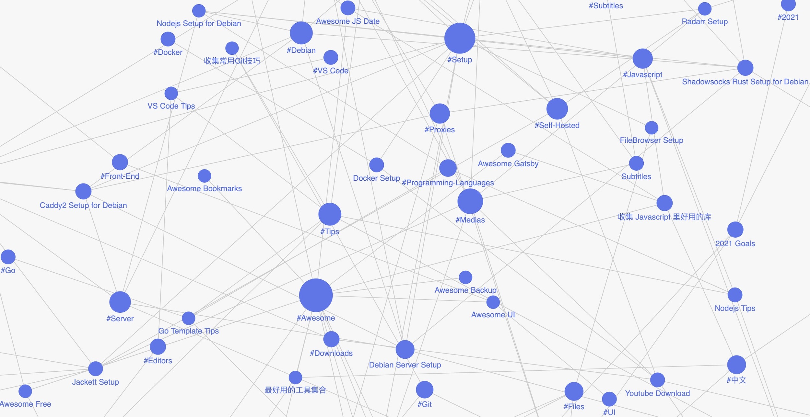

> A personal knowledge based wiki, where I share everything I know. I will be updating this wiki quite often as I use it myself daily both to keep an account of things I know as well as things I want to know and everything in-between. More details see [[about]]. I hope it's a gift for my grandchildren(if I have :)

- [Read this Wiki Online.](https://wiki.owenyoung.com/)
- [Read the Latest Updates](https://wiki.owenyoung.com/latest/)
- [Wiki Source](https://github.com/theowenyoung/wiki)

## You May Like

- [[books]]
- [[sources]]
- [[quotes]]
- [[tools]]
- [[answers]]
- [[fun]]
- [[thoughts]]
- [[awesome-articles]]

## Why I build this?

- Knowledge that is not remembered/not found is useless
- My memory is poor
- I am eager to show(show off) what I know
- Records make me feel like I'm not wasting my time
- The cost of writing a blog is high, but the cost of writing notes is low
- I need a non-vendor locked solution to motivate me to record permanently
- Plain text is forever

## How I build this?

The source and site are hosted on [GitHub - theowenyoung/wiki: Personal Knowledge Base Wiki, Everything I Know.](https://github.com/theowenyoung/wiki)

I am proud to have developed my own theme [GitHub - theowenyoung/gatsby-theme-primer-wiki: Gatsby Theme Primer Wiki](https://github.com/theowenyoung/gatsby-theme-primer-wiki), If you want to build your own wiki like this, you can follow [GitHub - theowenyoung/foam-template-gatsby-theme-primer-wiki](https://github.com/theowenyoung/foam-template-gatsby-theme-primer-wiki) or [obsidian-template-gatsby-theme-primer-wiki](https://github.com/theowenyoung/obsidian-template-gatsby-theme-primer-wiki) if you prefer Obsidian.

## About Me

- [[about]]
- [[now]]
- [[projects]]
- [[goals-2021]]

## Contact Me

- Email: `owen#owenyoung.com` (Replace `#` with `@`)
- Telegram: <https://t.me/itsowenyoung>
- Twitter [@TheOwenYoung](https://twitter.com/TheOwenYoung)
- 中文推 [@OwenYoungZh](https://twitter.com/OwenYoungZh)

## Other Resources

- Wiki [Everything I Know](https://wiki.owenyoung.com/)
- Blog [Owen's Story](https://blog.owenyoung.com)
- Github [@theowenyoung](https://github.com/theowenyoung)
- Patreon [@theowenyoung](https://www.patreon.com/theowenyoung)

## Graph Visualisation Preview

[//begin]: # "Autogenerated link references for markdown compatibility"
[about]: about.md "About Me and the Wiki"
[books]: books.md "读书笔记"
[sources]: sources.md "探索互联网上高质量的内容"
[quotes]: quotes.md "收集发人深省的话"
[tools]: tools.md "最好用的工具集合"
[answers]: answers.md "有意思的问题收集"
[fun]: fun.md "收集一些有意思的东西"
[thoughts]: thoughts.md "所思所想"
[awesome-articles]: awesome-articles.md "值得一看的文章列表"
[now]: now.md "What I’m doing now?"
[projects]: projects.md "Projects"
[goals-2021]: goals-2021.md "2021 Goals"
[//end]: # "Autogenerated link references"
