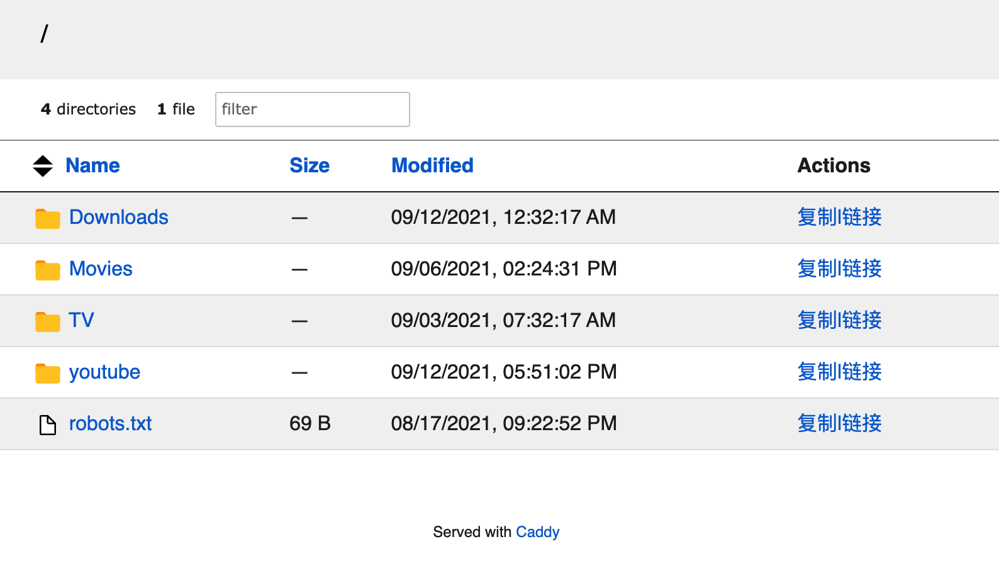
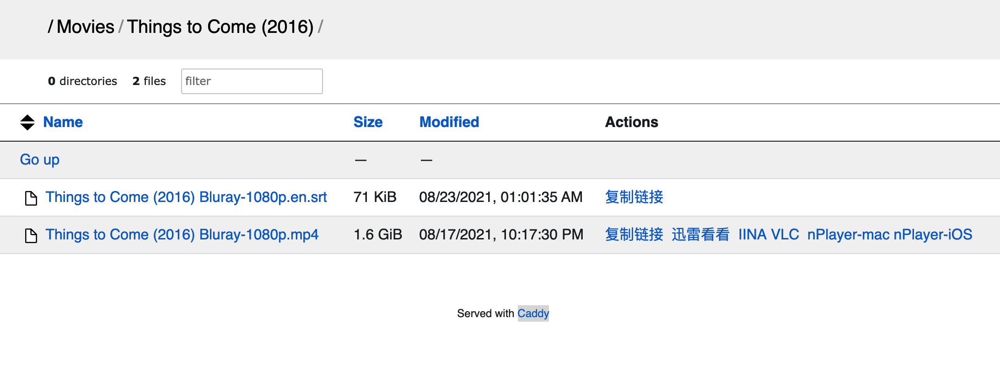

记录自己看过的电影，按年份排序，星星 ✨ 是我自己的评分，如有笔记则另外链接。基本上从 2021 开始记的，以前的由于没有及时建立这个第二大脑，基本都忘的差不多了。

Also see [[books]], [[tv-shows]]

## workflows

目前主要是用 [[qbittorrent-setup-for-debian]],[[jackett-setup]]在下载电影，买了一台 1T 的 VPS 作为 NAS。本来想用[[jellyfin-setup]]来作为影视中心的，但是使用后感觉客户端并不是 native 的，略卡，可能暂时还不胜用，所以索性直接上[[caddy-file-server-url-scheme]], 然后 mac 用 [IINA](https://iina.io/)，或者[迅雷看看](https://video.xunlei.com/)（大多数剧的字幕匹配做的好一点），手机端用 [nplayer](https://nplayer.com/)或[VLC](https://www.videolan.org/) 打开流文件。目前这样的体验是最爽的。

## 人生必看系列

这里放我自己觉得必看的一些电影：

- 黑客帝国

## 2021

- [ ] 梦幻骑士

[//begin]: # "Autogenerated link references for markdown compatibility"
[books]: books.md "读书笔记"
[tv-shows]: tv-shows.md "电视剧笔记"
[qbittorrent-setup-for-debian]: qbittorrent-setup-for-debian.md "qBittorrent setup for Debian"
[jackett-setup]: jackett-setup.md "Jackett Setup"
[jellyfin-setup]: jellyfin-setup.md "Jellyfin setup"
[caddy-file-server-url-scheme]: caddy-file-server-url-scheme.md "Caddy File Server Browser with URL Scheme"
[//end]: # "Autogenerated link references"ences"
